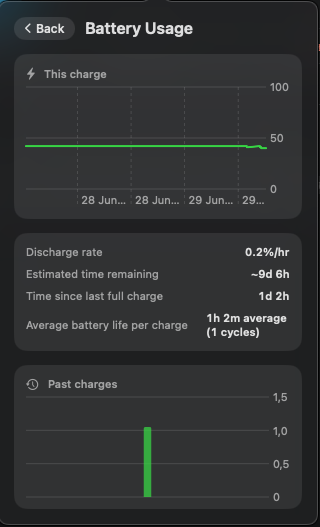

# Razer mouse control for macOS

A native menu bar app to control Razer mice on macOS. Razer does ship a Synapse for Mac now,
but its [supported-device list](https://mysupport.razer.com/app/answers/detail/a_id/14809/~/razer-synapse-for-mac-supported-and-compatible-devices)
is short and doesn't include the Cobra HyperSpeed or Atheris — this fills that gap. It talks
to the mouse directly over USB HID (no kernel extension, no driver install), using a protocol
ported from [OpenRazer](https://github.com/openrazer/openrazer).

Works best with the **Razer Cobra HyperSpeed** and the **Razer Atheris**, the two devices this
has actually been tested on. It detects any Razer mouse by name and should work with other
Razer mice that use the same HID protocol family, but those are untested, so treat support as
"likely to work, not verified" until someone confirms it on real hardware.

> Unofficial. Not affiliated with, authorized by, or endorsed by Razer Inc. See [NOTICE.md](NOTICE.md).
> 
> 
> 
> 


## Features

- **Battery** percentage in the menu bar, charging status, and a learned time-until-empty
  estimate. History and the estimate are kept per physical device (by serial number).
- **Battery usage graph**: a chart button beside the battery percentage opens the current
  discharge curve, the discharge rate, time since the last full charge, and a trend chart of
  past charge cycles with their average length.
- **DPI** with a slider (capped at each model's real maximum), the mouse's own preset stages
  read from the device, and a recallable custom value (per device).
- **Polling rate**: 125 / 500 / 1000 Hz.
- **RGB lighting**: static colour via an inline hue/saturation wheel, plus spectrum, wave, off,
  and a brightness slider.
- **Button remapping** for the side Back/Forward buttons (software, via a CGEvent tap):
  keyboard shortcuts (presets or a custom recorder), mouse clicks, and media keys. Saved per
  device.
- **Any Razer mouse is detected and named.** Controls a model lacks are hidden automatically
  (no lighting on the Atheris, no battery UI on wired-only mice).
- Settings are written to the mouse's **onboard memory** where supported, so they persist when
  the app is not running.

Settings persist across app restarts and reconnects, and the menu bar updates on its own when
the mouse connects, disconnects, or sleeps.

## Supported mice

| Mouse | Status |
|---|---|
| Razer Cobra HyperSpeed (wired + wireless) | Tested, works best |
| Razer Atheris | Tested, works best |
| Razer Cobra, Cobra Pro (wired + wireless) | Same protocol, not yet hardware-verified here |
| Any other Razer mouse | Detected and named; should work, but untested |

Adding a model is a small change to a registry plus on-hardware verification. See
[CONTRIBUTING.md](CONTRIBUTING.md).

### Known limitation: two identical mice without a hardware serial

Per-device settings (custom DPI, button remaps, battery history) are keyed by the mouse's own
serial number when it reports one, otherwise by its USB product ID. If you own **two mice of
the exact same model and that model doesn't expose a serial**, both fall back to the same
PID-based key and will share one settings/history file — there's no other stable identifier to
tell them apart. This doesn't affect mixed setups (different models, or models that do report
a serial).

## Requirements

macOS 14 or later (Apple Silicon).

**Connect over the 2.4 GHz dongle or a USB-C cable — not Bluetooth.** Razer only exposes its
control protocol (battery, DPI, lighting) over USB; over Bluetooth the mouse is just a plain
pointer, so MacRazer can't read or change anything. If your mouse has a mode switch, set it to
2.4 GHz. (MacRazer will tell you when it sees your mouse on Bluetooth.)

## Install

Download `MacRazer.dmg` from the [latest release](../../releases/latest), open it, and drag
**MacRazer** into Applications.

This build is unsigned (no paid Apple Developer ID), so on first launch Gatekeeper will say
the app "cannot be opened because it is from an unidentified developer" or "is damaged and
can't be opened". Both are the standard unsigned-app warning, not an actual problem. To open
it anyway, do **one** of:

- Right-click (or Control-click) **MacRazer.app** in Finder, choose **Open**, then confirm
  **Open** in the dialog. (Only needed once.)
- Or, in System Settings > Privacy & Security, scroll to the bottom and click **Open Anyway**
  next to the MacRazer warning.
- Or, from Terminal: `xattr -cr /Applications/MacRazer.app`, then open it normally.

After that it launches like any other app. It will then ask for **Input Monitoring**
permission (and **Accessibility** if you use button remapping); see [Permissions](#permissions)
below.

## Build and run

To build from source: Xcode 16 / Swift 6.1.

```sh
# Run the menu bar app directly (easiest while developing; uses your Terminal's permissions):
swift run MacRazer

# Or build a standalone .app:
./Scripts/setup-signing.sh      # one-time: a stable self-signed identity (see Permissions)
./Scripts/build-app.sh          # produces "MacRazer.app"
open "MacRazer.app"
```

## Permissions

- **Input Monitoring** is required to send and receive HID reports to the mouse. The app
  requests it on launch; grant it in System Settings > Privacy & Security > Input Monitoring.
- **Accessibility** is required only for button remapping (the event tap). The remap screen
  has a button to open the right settings pane.

macOS binds a permission grant to the app's code signature. An ad-hoc build gets a new
signature on every rebuild, which resets the grant, so either run `Scripts/setup-signing.sh`
once (it creates a stable self-signed identity that `build-app.sh` then uses) or develop with
`swift run MacRazer`, which inherits your Terminal's grants.

## Command-line diagnostics

The same binary runs read-only probes when given a subcommand (handy for verifying a new
mouse). Run these from a terminal:

```sh
swift run MacRazer info                 # list the mouse's HID interfaces
swift run MacRazer battery              # read battery %
swift run MacRazer dpi [x] [y]          # read or set DPI
swift run MacRazer poll [125|500|1000]  # read or set polling rate
swift run MacRazer rgb static ff0000    # static colour (or: spectrum | wave | off)
swift run MacRazer brightness [0-100]   # read or set LED brightness
```

## How it works

The mouse speaks Razer's HID protocol. We did not reverse-engineer it: the command bytes were
ported from OpenRazer's Linux driver and reimplemented in Swift over Apple's IOKit HID
Manager. No kernel extension is needed because Razer mice respond to standard USB HID feature
reports that any userspace process can send.

Full details, including the protocol, the per-device hardware quirks, and a file-by-file map,
are in [docs/DOCUMENTATION.md](docs/DOCUMENTATION.md). The complete feature history is in
[CHANGELOG.md](CHANGELOG.md).

## Contributing

Pull requests are welcome, especially **device profiles** so this works on more Razer mice.
See [CONTRIBUTING.md](CONTRIBUTING.md).

## License

GPL-2.0-or-later, see [LICENSE](LICENSE). The project is GPL because its HID protocol is
derived from OpenRazer. Full attribution and the trademark notice are in [NOTICE.md](NOTICE.md).

## Support

This is a free, unpaid community project. If it is useful to you, you can leave a tip:
[ko-fi.com/sorcrr](https://ko-fi.com/sorcrr).
