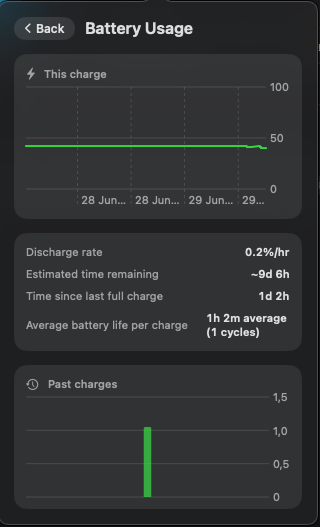

# Razer mouse control for macOS

A native menu bar app to control Razer mice on macOS. Razer does ship a Synapse for Mac now,
but its [supported-device list](https://mysupport.razer.com/app/answers/detail/a_id/14809/~/razer-synapse-for-mac-supported-and-compatible-devices)
is short and doesn't include the Cobra HyperSpeed or Atheris — this fills that gap. It talks
to the mouse directly over USB HID for wired and 2.4 GHz connections (no kernel extension,
no driver install), using a protocol ported from
[OpenRazer](https://github.com/openrazer/openrazer).

Works best with the **Razer Cobra HyperSpeed** and the **Razer Atheris**, the two devices this
has actually been tested on. It detects any Razer mouse by name and should work with other
Razer mice that use the same HID protocol family, but those are untested, so treat support as
"likely to work, not verified" until someone confirms it on real hardware.

MacRazer also has experimental Bluetooth GATT support for the **Basilisk V3 X HyperSpeed**
(Bluetooth PID `0x00BA`). This model-specific path reads battery, DPI stages and brightness,
supports static lighting and the onboard DPI Cycle assignment, and leaves polling rate and
profiles unavailable over Bluetooth. The existing USB HID path remains in place for wired and
2.4 GHz connections. Other Bluetooth models are not yet supported.

On a paired Basilisk, hardware checks confirmed battery and DPI reads, all five DPI stages,
brightness, a same-value DPI write/readback, BLE reconnect, reads after the mouse's sleep
timeout and Play/Pause from the physical DPI button after restart. The BLE protocol is
documented by [OpenSnek](https://github.com/gh123man/OpenSnek/blob/main/docs/protocol/BLE_PROTOCOL.md);
MacRazer uses its own implementation. The receiver is not needed to validate the Bluetooth
feature.

> Unofficial. Not affiliated with, authorized by, or endorsed by Razer Inc. See [NOTICE.md](NOTICE.md).
> 
> 
> 
> 


## Features

- **Battery** percentage in the menu bar, charging status, and a learned time-until-empty
  estimate. History and the estimate are kept per physical device (by serial number).
- **Battery usage graph**: a chart button beside the battery percentage opens the current
  discharge curve, the discharge rate, time since the last full charge, and a trend chart of
  past charge cycles with their average length.
- **DPI** with a slider (capped at each model's real maximum), the mouse's own preset stages
  read from the device, and a recallable custom value (per device).
- **Polling rate**: 125 / 500 / 1000 Hz.
- **RGB lighting**: static colour via an inline hue/saturation wheel, plus spectrum, wave, off,
  and a brightness slider.
- **Button remapping** for the side Back/Forward buttons (software, via a CGEvent tap):
  keyboard shortcuts (presets or a custom recorder), mouse clicks, and media keys. Saved per
  device.
- **Basilisk V3 X HyperSpeed over Bluetooth** can configure the DPI Cycle button with the shared
  mouse actions and keyboard shortcut recorder. The onboard Multi-function/Hypershift modifier
  is handled inside the mouse and cannot be remapped by macOS.
- **Any Razer mouse is detected and named.** Controls a model lacks are hidden automatically
  (no lighting on the Atheris, no battery UI on wired-only mice).
- Settings are written to the mouse's **onboard memory** where supported, so they persist when
  the app is not running.
- **Starts at login** (on by default, switchable in the popover and in System Settings ›
  General › Login Items), so the menu bar item is there after a reboot.
- **Updates install themselves**: when a new release is out, "Update & Restart" downloads it,
  checks it, replaces the installed app and relaunches — no dragging a DMG. It falls back to
  the plain DMG download when MacRazer is somewhere it can't replace itself (still on the disk
  image, or in a folder you can't write to). The card also links to **what's in the release**,
  so the choice isn't blind.

Settings persist across app restarts and reconnects, and the menu bar updates on its own when
the mouse connects, disconnects, or sleeps.

## Supported mice

"Verified" below means someone ran the CLI probes against the mouse and posted the output,
not that the protocol tables say it should work. Where nobody has, the row says so.

| Mouse | Verified on hardware | By |
|---|---|---|
| Razer Cobra HyperSpeed (wired + wireless) | Everything, continuously — the development mouse | maintainer |
| Razer Atheris | Battery, DPI, polling | maintainer |
| Razer Basilisk V3 X HyperSpeed | Battery, DPI, DPI stages, polling, lighting, brightness | [@joelday](https://github.com/joelday) |
| Razer Viper Ultimate (Wireless) | Battery, DPI, polling, brightness | [@raphaelchenouard](https://github.com/raphaelchenouard) |
| Razer Orochi 2013 | DPI only | [@raphaelchenouard](https://github.com/raphaelchenouard) |
| Razer Basilisk V3 | Nothing; reported working by a user | — |
| Razer Cobra, Cobra Pro (wired + wireless) | Nothing; same protocol family, values from OpenRazer | — |
| Razer Basilisk X HyperSpeed | Nothing; values from OpenRazer | — |
| Razer Viper Ultimate (Wired) | Nothing; its wireless sibling is verified | — |
| Any other Razer mouse | Nothing; detected and named, controls attempted | — |

An unverified mouse is not a broken one. Detection and naming work for any Razer mouse, and
the controls are attempted with values taken from OpenRazer's tables — they usually work. The
column is about who has actually seen it happen.

Adding a model is a small change to a registry plus on-hardware verification. See
[CONTRIBUTING.md](CONTRIBUTING.md).

### Buttons MacRazer cannot see

Remapping works by watching macOS mouse events, so it can only reach buttons the mouse
actually reports to the Mac. Some buttons are handled *inside* the mouse and never send
anything — no app can detect those, MacRazer included.

The **Basilisk V3 X HyperSpeed's Multi-function trigger** ships as the Hypershift modifier.
The firmware handles it internally, so pressing it alone sends no macOS mouse event. On
Bluetooth, the device also rejects changing that Hypershift assignment; MacRazer marks it as
unsupported instead of pretending it can remap it.

The **DPI Cycle** button is different: it normally changes the active DPI stage inside the
mouse, so the macOS event remapper cannot see it. On the Basilisk V3 X HyperSpeed over
Bluetooth, MacRazer reads and configures that onboard button through the mouse's GATT control
protocol. The button editor offers the DPI Cycle default, mouse-button actions, the shared
shortcut presets, and **Record Custom Shortcut…**. Every assignment is read back before
MacRazer reports success.

**Media** (Play/Pause, next/previous track, volume and mute) and **Double Click** use a
software bridge (keyboard capture also requires effective Input Monitoring access): the onboard DPI slot sends keyboard F20, which MacRazer intercepts and
converts to the selected action. These actions require the app to be running, Accessibility
to be granted, the Basilisk connected, and its F20 assignment verified. F20 on other keyboards
is also reserved while this bridge is active. Ordinary modified F20 shortcuts pass through.
MacRazer rechecks the active DPI assignment on each Bluetooth connection and reapplies the
saved F20 bridge if the mouse firmware has returned the live projection to its default after
sleep or reconnect. Select **DPI Cycle (default)** in MacRazer to clear the saved software
assignment and restore onboard DPI cycling. This does not claim a native BLE media-command
implementation.

### Known limitation: two identical mice without a hardware serial

Per-device settings (custom DPI, button remaps, battery history) are keyed by the mouse's own
serial number when it reports one, otherwise by its USB product ID. If you own **two mice of
the exact same model and that model doesn't expose a serial**, both fall back to the same
PID-based key and will share one settings/history file: there's no other stable identifier to
tell them apart. This doesn't affect mixed setups (different models, or models that do report
a serial).

## Requirements

macOS 14 or later (Apple Silicon).

For other models, use the 2.4 GHz dongle or USB-C. Bluetooth control is currently experimental
and limited to the Basilisk V3 X HyperSpeed; macOS may request Bluetooth access on first use.
It does not enable polling-rate or profile controls over BLE.

The paired-device check is opt-in and writes only the DPI value already active on the mouse:
`MACRAZER_BLE_HARDWARE_TEST=1 swift test --filter BLEHardwareIntegrationTests`.

## Install

Download `MacRazer.dmg` from the [latest release](../../releases/latest), open it, and drag
**MacRazer** into Applications.

This build is unsigned (no paid Apple Developer ID), so on first launch Gatekeeper will say
the app "cannot be opened because it is from an unidentified developer" or "is damaged and
can't be opened". Both are the standard unsigned-app warning, not an actual problem. To open
it anyway, do **one** of:

- Right-click (or Control-click) **MacRazer.app** in Finder, choose **Open**, then confirm
  **Open** in the dialog. (Only needed once.)
- Or, in System Settings > Privacy & Security, scroll to the bottom and click **Open Anyway**
  next to the MacRazer warning.
- Or, from Terminal: `xattr -cr /Applications/MacRazer.app`, then open it normally.

After that it launches like any other app. USB and 2.4 GHz control needs **Input Monitoring**;
the Basilisk Bluetooth GATT path does not. **Accessibility** is only needed for software button
remapping; see [Permissions](#permissions) below.

## Build and run

To build from source: Xcode 16 / Swift 6.1.

```sh
# Run the menu bar app directly (easiest while developing; uses your Terminal's permissions):
swift run MacRazer

# Or build a standalone .app:
./Scripts/setup-signing.sh      # one-time: a stable self-signed identity (see Permissions)
./Scripts/build-app.sh          # produces "MacRazer.app"
open "MacRazer.app"
```

## Permissions

- **Input Monitoring** is required for USB and 2.4 GHz HID reports. The Basilisk Bluetooth
  GATT control path itself does not use it; the F20 software bridge does need effective keyboard
  capture through Input Monitoring to turn the DPI button into media or shortcut actions. Grant
  it in System Settings > Privacy & Security > Input Monitoring.
- **Accessibility** is required only for software button remapping (the event tap), including
  when the mouse is connected by Bluetooth. These remaps run while MacRazer is open; they are
  separate from onboard button bindings. The remap screen has a button to open the right
  settings pane.

macOS binds a permission grant to the app's code signature. An ad-hoc build gets a new
signature on every rebuild, which resets the grant, so either run `Scripts/setup-signing.sh`
once (it creates a stable self-signed identity that `build-app.sh` then uses) or develop with
`swift run MacRazer`, which inherits your Terminal's grants.

If a build seems to stop dead at the codesigning step, it hasn't crashed: macOS is showing a
keychain prompt for the signing key (the build script says so once it has been waiting a few
seconds). Click **Always Allow** (not Allow), then run `Scripts/setup-signing.sh --repair`
once to grant codesign standing access so nothing prompts again.

## Command-line diagnostics

The same binary runs read-only probes when given a subcommand (handy for verifying a new
mouse). Run these from a terminal:

```sh
swift run MacRazer info                 # list the mouse's HID interfaces
swift run MacRazer battery              # read battery %
swift run MacRazer dpi [x] [y]          # read or set DPI
swift run MacRazer poll [125|500|1000]  # read or set polling rate
swift run MacRazer rgb static ff0000    # static colour (or: spectrum | wave | off)
swift run MacRazer brightness [0-100]   # read or set LED brightness
```

## How it works

The mouse speaks Razer's HID protocol. We did not reverse-engineer it: the command bytes were
ported from OpenRazer's Linux driver and reimplemented in Swift over Apple's IOKit HID
Manager. No kernel extension is needed because Razer mice respond to standard USB HID feature
reports that any userspace process can send.

Full details, including the protocol, the per-device hardware quirks, and a file-by-file map,
are in [docs/DOCUMENTATION.md](docs/DOCUMENTATION.md). The complete feature history is in
[CHANGELOG.md](CHANGELOG.md).

## Built with

MacRazer was built with [Hiveship](https://hiveship.app/), an issue tracker for planning work,
tracking bugs, and handing issues to coding agents as well as the people on your team.

## Contributing

Pull requests are welcome, especially **device profiles** so this works on more Razer mice.
See [CONTRIBUTING.md](CONTRIBUTING.md).

## License

GPL-2.0-or-later, see [LICENSE](LICENSE). The project is GPL because its HID protocol is
derived from OpenRazer. Full attribution and the trademark notice are in [NOTICE.md](NOTICE.md).

## Support

This is a free, unpaid community project. If it is useful to you, you can leave a tip:
[ko-fi.com/sorcrr](https://ko-fi.com/sorcrr).
